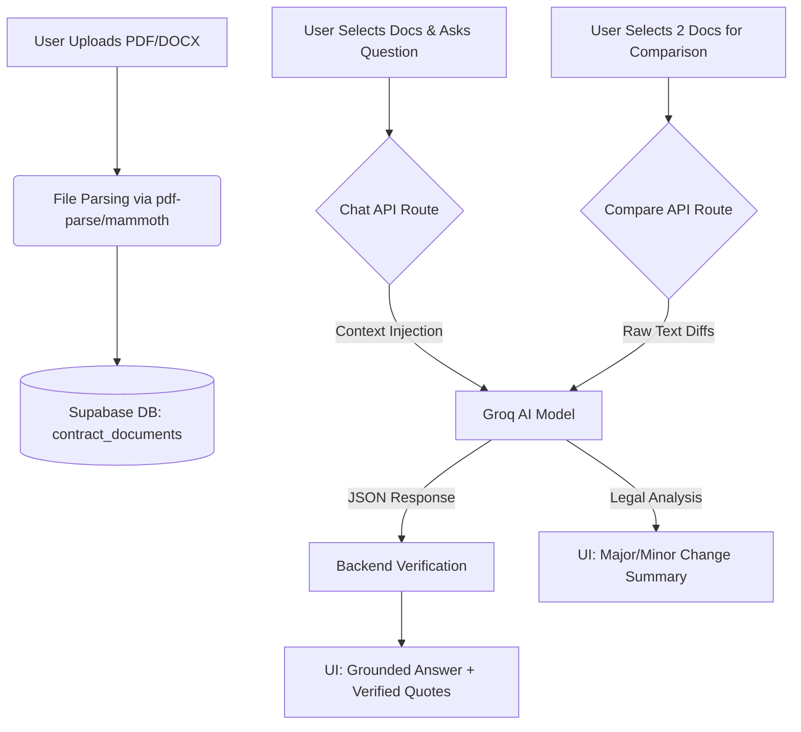

# Legal Contract Analyzer ⚖️

**GitHub Repository:** [https://github.com/Premkambaliya/assingment1](https://github.com/Premkambaliya/assingment1)  
**Live Deployment:** [https://asingment.vercel.app/](https://asingment.vercel.app/)

## What the App Does
This application is an AI-powered Legal Contract Analyzer built with Next.js, Supabase, and the Groq AI API. It allows users to:
1. **Upload Documents:** Upload legal contracts (PDF/DOCX). The app extracts and parses the text so it is fully searchable.
2. **AI Chat with Verified Quotes:** Ask questions about specific contracts (e.g., "What is the liability cap?"). The AI reads the document and provides an answer grounded entirely in the text, accompanied by clickable, **verified citations** proving exactly where the AI found the information.
3. **Document Comparison (Part C):** Select an "Original" and a "New" version of a contract. The app analyzes the differences and uses AI to generate plain-English summaries of the changes, categorizing them as "Major" (legal obligation changes) or "Minor" (typos/formatting).

---

## Workflow Diagram

Here is a high-level overview of how data flows through the application:



---

## Screenshots

### 1. Document Chat & Verified Quotes
*Ask questions and get instant, grounded answers with citations you can trust.*


### 2. Document Library & Upload
*A clean, premium glassmorphism interface to manage your contracts.*


### 3. AI Document Comparison (Part C)
*Automatically detect and classify changes between contract versions.*


---

## Technologies Used
- **Frontend/Backend:** Next.js (App Router)
- **Database/Storage:** Supabase (PostgreSQL)
- **AI/LLM:** Groq API (High-speed inference)
- **Styling:** CSS (Custom Glassmorphism Design)

---

## How to Run it Locally

1. **Clone the repository:**
   ```bash
   git clone https://github.com/Premkambaliya/assingment1.git
   cd assingment1/next-app
   ```

2. **Install dependencies:**
   ```bash
   npm install
   ```

3. **Set up Environment Variables:**
   Create a `.env` file in the root of the `next-app` directory and add your Supabase and Groq API keys:
   ```env
   NEXT_PUBLIC_SUPABASE_URL=your_supabase_url
   NEXT_PUBLIC_SUPABASE_ANON_KEY=your_supabase_anon_key
   GROQ_API_KEY=your_groq_api_key
   ```

4. **Run the development server:**
   ```bash
   npm run dev
   ```
   Open [http://localhost:3000](http://localhost:3000) with your browser to see the result.

---

## What is Finished and What is Not

### ✅ Finished
- Document uploading and fast text extraction (PDF/DOCX).
- Document Chat with system-prompt injected RAG.
- Strict Quote verification system (UI highlights verified vs. unverified sources).
- Chat Session Management (New Chat, Delete Chat, smart monotonic numbering).
- Document Comparison (Part C) with AI significance analysis (Major/Minor classifications).
- Custom, highly responsive "Glassmorphism" UI.

### 🚧 Not Finished / Future Work
- **User Authentication:** Currently, all users share the same workspace. Integrating Clerk or Supabase Auth is needed to provide private, secure workspaces.
- **Vector Database (pgvector):** Currently, the full document text is injected directly into the AI's context window. While this works incredibly well for single documents due to Groq's large context windows, a true vector database implementation (RAG) is needed to scale to searching across hundreds of massive documents simultaneously without hitting token limits.
