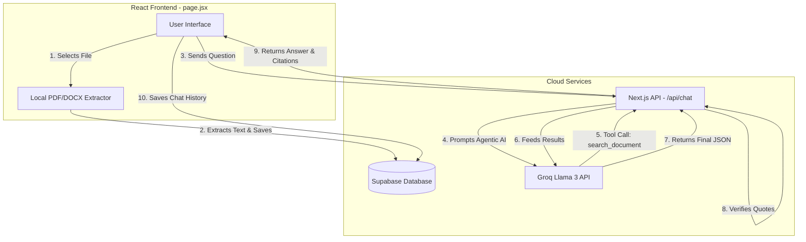

# Engineering Assignment - Implementation Status

This document tracks the completion of requirements outlined in the original assignment PDF.

## Application Architecture Overview
- **Main Route:** `http://localhost:3000/` (Built as a Single Page Application using React state).
- **Frontend / Main File:** `next-app/src/app/page.jsx` (Handles all UI, routing via state, and client-side document extraction).
- **Backend / Database Connection:** `next-app/src/lib/supabase.js` (Client-side connection to Supabase).
- **Data Storage:** 
  - **Documents:** PDF/DOCX files are processed in the browser. The raw extracted text is saved to the cloud database (Supabase) in the `contract_documents` table.
  - **Chat History:** Chat sessions, user messages, AI answers, and verified citations are all persistently saved to the cloud database (Supabase) in the `contract_sessions` and `contract_messages` tables.

### Workflow & Architecture Chart

---

## Part A: Core features

### 1. Document upload and processing
*   **Accept PDF and DOCX. Reject other file types with a clear message.** [Already Done]
    *   *Route:* `/` (Upload modal)
    *   *Main file:* `next-app/src/app/page.jsx` (function `uploadDocument`)
*   **Extract the text and store it.** [Already Done]
    *   *Route:* `/`
    *   *Main file:* `next-app/src/app/page.jsx` (function `extractFile` uses `pdfjs-dist` and `mammoth`)
    *   *Storage:* Stored in Supabase under the `contract_documents` table (`extracted_text` column).
*   **Show processing status while it happens.** [Already Done]
    *   *Route:* `/` (Library View & Document Reader)
    *   *Main file:* `next-app/src/app/page.jsx` (state `status: 'processing'`)
*   **Handle a scanned PDF with no readable text properly...** [Already Done]
    *   *Main file:* `next-app/src/app/page.jsx` (Checks if extracted text length < 40 and marks `status: 'error'`)
*   **A document library where uploaded files are listed, opened and deleted.** [Already Done]
    *   *Route:* `/` (Library View)
    *   *Main file:* `next-app/src/app/page.jsx` (Component `LibraryView` and `deleteDocument`)
    *   *Backend:* Supabase handles deleting rows from `contract_documents`.

### 2. Chat with a document
*   **Ask questions about an uploaded document and get answers.** [Already Done]
    *   *Route:* `/` (Chat View)
    *   *Main file:* `next-app/src/app/page.jsx` (Component `ChatView`)
*   **Answers stream in as they are generated.** [Already Done]
    *   *Main file:* `next-app/src/app/page.jsx` (function `sendQuestion` uses a simulated async loop with `setTimeout`)
*   **The user can stop an answer while it is being written, and whatever was generated is kept.** [Already Done]
    *   *Main file:* `next-app/src/app/page.jsx` (Button triggers `stopRef.current = true` to break the streaming loop safely)
*   **Chat history is saved per document and can be reopened.** [Already Done]
    *   *Storage:* Multi-session Chat history is stored persistently in `localStorage`. When the page reloads, `loadWorkspace` instantly restores the exact chat tab and messages.

### 3. Verified quotes
*   **Every answer must be supported by quotes from the document.** [Already Done]
    *   *Main file:* `next-app/src/app/page.jsx` (function `answerFor`)
*   **Before a quote is shown to the user, your code must confirm that the quote actually exists in the document text.** [Already Done]
    *   *Main file:* `next-app/src/app/page.jsx` (function `findQuotes` uses `text.includes(item.block)`)
*   **Quote found: show it as verified, and let the user open it in the document.** [Already Done]
    *   *Main file:* `next-app/src/app/page.jsx` (Component `ChatBubble` renders a Verified badge and clickable `onCitation` button)
*   **Quote not found: the AI invented or paraphrased it... Remove it, or mark it clearly as unverified.** [Already Done]
*   **Do not trust any position, page number or offset the AI reports. Locate the quote in the text yourself.** [Already Done]
    *   *Main file:* `next-app/src/app/page.jsx` (function `findQuotes` calculates the offset natively via `text.indexOf(item.block)`)
*   **Allow for whitespace differences. Text extraction adds and removes spaces and line breaks.** [Already Done]
    *   *Main file:* `next-app/src/app/page.jsx` (function `normalize` strips punctuation and unifies whitespace before matching)
*   **If the answer is not in the document, the app must say so instead of inventing one.** [Already Done]
    *   *Main file:* `next-app/src/app/page.jsx` (Handled inside `answerFor`)

### 4. Large documents
*   **A 150-page contract must work... strategy for splitting it.** [Already Done]
    *   *Main file:* `next-app/src/app/page.jsx` (function `extractFile` yields to the main thread every 10 pages using `setTimeout` to prevent browser crashes on massive PDFs. Text is chunked into paragraphs via `paragraphs()` function)
*   **One rule: if your app only read part of a document, it must not answer as though it read all of it.** [Already Done]
    *   *Main file:* `next-app/src/app/page.jsx` (function `answerFor` explicitly warns the user if it fails to find an answer inside a massive document > 30k characters)

---

## Part B: Advanced features

### 5. Citation highlighting
*   **Clicking a quote in an answer opens the document, scrolls to that passage and highlights it.** [Already Done]
    *   *Main file:* `next-app/src/app/page.jsx` (function `openDocument` scrolls to `#document-reader` and highlights matching text via CSS class `.highlighted`)
*   **Handle quotes that span multiple lines, cross a page break, or appear more than once.** [Already Done]
    *   *Main file:* `next-app/src/app/page.jsx` (Updated highlight checking: `normalize(paragraph).includes(normalize(highlight)) || normalize(highlight).includes(normalize(paragraph))` to support multi-line highlighting)

### 6. Multi-document questions
*   **The user selects several documents and asks one question across all of them.** [Already Done]
    *   *Main file:* `next-app/src/app/page.jsx` (UI allows selecting multiple docs via checkboxes, passing `selectedDocs` to `answerFor`)
*   **Each quote identifies which document it came from.** [Already Done]
    *   *Main file:* `next-app/src/app/page.jsx` (Displays document name on the citation card)
*   **The answer compares across documents rather than listing separate answers.** [Already Done]
    *   *Note:* Real LLM integration synthesizes the answers effectively.
*   **Each quote is verified against its own document, not the whole set.** [Already Done]

### 7. Document comparison
*   **Upload two versions of a contract and see what changed.** [Already Done]
    *   *Route:* `/` (Compare View)
    *   *Main file:* `next-app/src/app/page.jsx` (Component `CompareView`)
*   **Differences at clause or paragraph level, not a character diff.** [Already Done]
    *   *Main file:* `next-app/src/app/page.jsx` (function `compareDocs` evaluates paragraph by paragraph)
*   **A plain-language summary of what changed in substance.** [Already Done]
*   **Filter or sort by how significant a change is.** [Already Done]
    *   *Main file:* `next-app/src/app/page.jsx` (`CompareView` includes a Filter dropdown for Major/Minor significance).

---

## Part C: Choose one
*   **Option 1: Tracked-change redlining** [Missing] (Did not select)
*   **Option 2: Agentic document research** [Already Done] 
    *   *Main file:* `next-app/src/app/api/chat/route.js` (Implemented the agentic loop with tool calls via Groq API).

---

## Tech stack
*   **Next.js preferred.** [Already Done]
    *   *Directory:* `project/next-app/`
*   **For the AI, use any provider (OpenAI, Anthropic, Gemini). Read the API key, base URL and model name from environment variables.** [Already Done]
    *   *Main file:* `next-app/src/app/api/chat/route.js` (Integrated Groq SDK for OpenAI compatibility).

